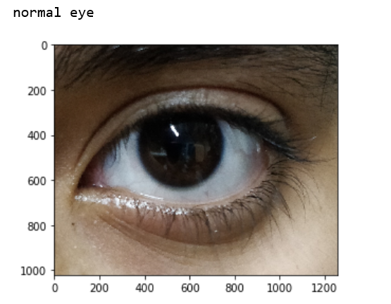

# Common-disease-detection-using-neural-networks

## What is this project?
This is an application that is used to detect very common diseases that display their symptoms externally like ey, skin, mouth, nail diseases
## How was it achieved?
  * The data was collected from Gogle images using a simple chrome extension called **fatkun**
  * The data was pre processed and stored as pickles using OpenCV
  * The data was trained using 27 different combinations of Neural Networks and the best model was chose as the one with the least validation using **Tensorboard** 
  * The best model was chosen and reconstructed for the best results.
 ## Tensorboard visualisation
  
 
 ## Sample predictions
 

